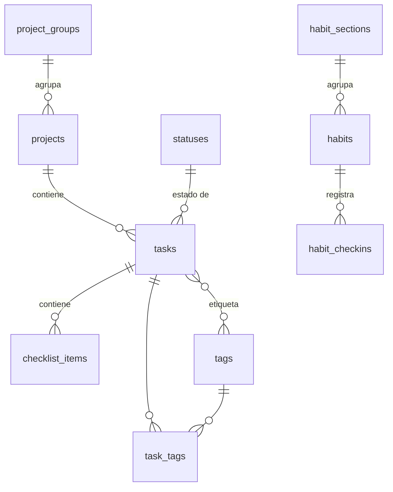

# Estructura de base de datos

Diseño de tablas Postgres (para Supabase + PostgREST) que replica la organización
interna de TickTick de **hábitos, tareas y proyectos**. TickTick queda **fuera** del
proyecto: no se migran datos ni se sincroniza con su API — su modelo se usa solo como
**inspiración** porque está bien estructurado.

Fuente: `.claude/ticktick-api-doc.md` (TickTick Open API) y los ficheros `ticktick_*.http`.

## Decisiones de diseño

- **Un solo usuario (personal).** Sin columna `user_id` ni multi-tenancy. Las políticas
  RLS pueden abrirse por completo o cerrarse a una sola clave; se deja fuera de este
  diseño (es configuración de Supabase, no del modelo de datos).
- **snake_case idiomático Postgres.** Cada campo camelCase de TickTick se renombra
  (`repeatRule` → `repeat_rule`, `dueDate` → `due_date`, …). El mapeo campo→columna se
  documenta en cada tabla.
- **UUID nativo como PK** (`gen_random_uuid()`). No se guarda el id string de TickTick:
  no hay importación desde TickTick.
- **Focus queda excluido** por decisión explícita (no se modela Pomodoro/Timing).
- **Tipos nativos en vez de los formatos de transporte de la API:**
  - Fechas/horas con zona → `timestamptz` (TickTick las manda como `yyyy-MM-dd'T'HH:mm:ssZ`).
  - `stamp` / `targetStartDate` (enteros `YYYYMMDD`) → `date`.
  - Listas (`reminders`, `exDates`) → arrays Postgres (`text[]`, `date[]`).
- **Campos de transporte que se descartan** (no aportan al modelo local):
  - `etag` — token de concurrencia de la API de TickTick; Postgres gestiona la suya.
  - `year` en los checkins — es solo una agrupación del JSON de respuesta.
  - `permission` en proyectos — concepto de compartición; irrelevante con un solo usuario.
  - `totalCheckIns` / `completedCycles` como *cache* — son derivables de los checkins
    (ver notas en `habits`).
- **Timestamps de auditoría idiomáticos.** Los `createdTime`/`modifiedTime` de TickTick
  se representan como `created_at`/`updated_at` con `default now()` y trigger de
  actualización, en vez de exigir que el cliente los mande.
- **Enumeraciones como `CHECK`** (no tipos `enum` nativos) para poder ampliarlas sin
  `ALTER TYPE` y mantener PostgREST simple.

## Entidades y relaciones

TickTick organiza los datos en tres árboles independientes que aquí replicamos:

- **Proyectos** (listas de tareas): agrupados en carpetas (`project_groups`), contienen
  **tareas** (`tasks`), que a su vez contienen subtareas (`checklist_items`) y etiquetas
  (`tags`, N:M). Cada tarea tiene un **estado** (`statuses`: p.ej. *Por hacer* /
  *En progreso* / *Hecho*).
- **Hábitos**: agrupados en secciones (`habit_sections`), con un histórico de
  registros diarios (`habit_checkins`).



---

## Tablas

### `project_groups` — carpetas de proyectos

TickTick agrupa proyectos en carpetas mediante `Project.groupId`. No hay endpoint propio
en la Open API, pero la referencia existe, así que se modela como tabla de primer nivel.

| Campo TickTick | Columna | Tipo | Notas |
| --- | --- | --- | --- |
| (implícito) `groupId` | `id` | `uuid` PK | |
| — | `name` | `text` not null | Nombre de la carpeta |
| `sortOrder` | `sort_order` | `bigint` default 0 | |
| — | `created_at` / `updated_at` | `timestamptz` | Auditoría |

```sql
create table project_groups (
    id         uuid primary key default gen_random_uuid(),
    name       text not null,
    sort_order bigint not null default 0,
    created_at timestamptz not null default now(),
    updated_at timestamptz not null default now()
);
```

### `projects` — proyectos / listas

| Campo TickTick | Columna | Tipo | Notas |
| --- | --- | --- | --- |
| `id` | `id` | `uuid` PK | |
| `name` | `name` | `text` not null | |
| `color` | `color` | `text` | Hex, p.ej. `#F18181` |
| `sortOrder` | `sort_order` | `bigint` default 0 | |
| `closed` | `closed` | `boolean` default false | Proyecto archivado/cerrado |
| `groupId` | `group_id` | `uuid` FK → `project_groups` | Nullable (proyecto suelto) |
| `viewMode` | `view_mode` | `text` | `list` \| `kanban` \| `timeline` |
| `kind` | `kind` | `text` | `TASK` \| `NOTE` |
| `permission` | *(descartado)* | — | Compartición; irrelevante mono-usuario |

```sql
create table projects (
    id         uuid primary key default gen_random_uuid(),
    name       text not null,
    color      text,
    sort_order bigint not null default 0,
    closed     boolean not null default false,
    group_id   uuid references project_groups (id) on delete set null,
    view_mode  text not null default 'list'
        check (view_mode in ('list', 'kanban', 'timeline')),
    kind       text not null default 'TASK'
        check (kind in ('TASK', 'NOTE')),
    created_at timestamptz not null default now(),
    updated_at timestamptz not null default now()
);

create index on projects (group_id);
```

### `statuses` — estados de tarea

Reformula el concepto de "columna kanban" de TickTick como un catálogo de **estados de
tarea** (p.ej. *Por hacer*, *En progreso*, *Hecho*). Cada tarea apunta a uno vía
`tasks.status_id`. Es **global** (compartido por todos los proyectos), no por proyecto:
con un solo usuario un único flujo de estados suele bastar. *(Si algún día quisieras
flujos distintos por proyecto, se le añade una FK `project_id`.)*

Sustituye al campo `status` (smallint `0=Normal`/`2=Completed`) de TickTick: el estado
"completado" pasa a ser **una fila más** de esta tabla en vez de un flag numérico;
`tasks.completed_time` sigue registrando *cuándo* se completó.

| Campo TickTick | Columna | Tipo | Notas |
| --- | --- | --- | --- |
| — | `id` | `uuid` PK | |
| `Column.name` | `name` | `text` not null | p.ej. `Por hacer`, `Hecho` |
| — | `color` | `text` | Opcional, para pintar el estado |
| `Column.sortOrder` | `sort_order` | `bigint` default 0 | Orden del flujo |

```sql
create table statuses (
    id         uuid primary key default gen_random_uuid(),
    name       text not null,
    color      text,
    sort_order bigint not null default 0,
    created_at timestamptz not null default now(),
    updated_at timestamptz not null default now()
);
```

### `tasks` — tareas

| Campo TickTick | Columna | Tipo | Notas |
| --- | --- | --- | --- |
| `id` | `id` | `uuid` PK | |
| `projectId` | `project_id` | `uuid` FK → `projects` not null | |
| (estado) | `status_id` | `uuid` FK → `statuses` | Nullable; estado actual de la tarea |
| `title` | `title` | `text` not null | |
| `content` | `content` | `text` | Cuerpo de nota/tarea |
| `desc` | `description` | `text` | Descripción de checklist |
| `isAllDay` | `is_all_day` | `boolean` default false | |
| `startDate` | `start_date` | `timestamptz` | |
| `dueDate` | `due_date` | `timestamptz` | |
| `timeZone` | `time_zone` | `text` | Zona de las fechas flotantes |
| `repeatFlag` | `repeat_rule` | `text` | RRULE, p.ej. `RRULE:FREQ=DAILY;INTERVAL=1` |
| `reminders` | `reminders` | `text[]` | Triggers, p.ej. `TRIGGER:P0DT9H0M0S` |
| `priority` | `priority` | `smallint` default 0 | 0=None, 1=Low, 3=Medium, 5=High |
| `completedTime` | `completed_time` | `timestamptz` | |
| `sortOrder` | `sort_order` | `bigint` default 0 | |
| `kind` | `kind` | `text` | `TEXT` \| `NOTE` \| `CHECKLIST` |
| `tags` | → `tags` (N:M) | — | Vía `task_tags`; ver abajo |

Notas:
- `status_id` reformula las columnas kanban de TickTick como estados de tarea (ver tabla
  `statuses`); sustituye al `status` smallint (0/2) del esquema `Task` de la Open API.
- `desc` se renombra a `description` porque `desc` es palabra reservada de SQL.

```sql
create table tasks (
    id             uuid primary key default gen_random_uuid(),
    project_id     uuid not null references projects (id) on delete cascade,
    status_id      uuid references statuses (id) on delete set null,
    title          text not null,
    content        text,
    description    text,
    is_all_day     boolean not null default false,
    start_date     timestamptz,
    due_date       timestamptz,
    time_zone      text,
    repeat_rule    text,
    reminders      text[] not null default '{}',
    priority       smallint not null default 0 check (priority in (0, 1, 3, 5)),
    completed_time timestamptz,
    sort_order     bigint not null default 0,
    kind           text not null default 'TEXT'
        check (kind in ('TEXT', 'NOTE', 'CHECKLIST')),
    created_at     timestamptz not null default now(),
    updated_at     timestamptz not null default now()
);

create index on tasks (project_id);
create index on tasks (status_id);
create index on tasks (due_date);
```

### `checklist_items` — subtareas de una tarea

| Campo TickTick | Columna | Tipo | Notas |
| --- | --- | --- | --- |
| `id` | `id` | `uuid` PK | |
| (padre) | `task_id` | `uuid` FK → `tasks` not null | |
| `title` | `title` | `text` not null | |
| `status` | `status` | `smallint` default 0 | 0=Normal, 1=Completed |
| `completedTime` | `completed_time` | `timestamptz` | |
| `isAllDay` | `is_all_day` | `boolean` default false | |
| `startDate` | `start_date` | `timestamptz` | |
| `timeZone` | `time_zone` | `text` | |
| `sortOrder` | `sort_order` | `bigint` default 0 | |

```sql
create table checklist_items (
    id             uuid primary key default gen_random_uuid(),
    task_id        uuid not null references tasks (id) on delete cascade,
    title          text not null,
    status         smallint not null default 0 check (status in (0, 1)),
    completed_time timestamptz,
    is_all_day     boolean not null default false,
    start_date     timestamptz,
    time_zone      text,
    sort_order     bigint not null default 0,
    created_at     timestamptz not null default now(),
    updated_at     timestamptz not null default now()
);

create index on checklist_items (task_id);
```

### `tags` + `task_tags` — etiquetas (N:M)

En la Open API las etiquetas de una tarea son un array de strings (`["work","urgent"]`),
pero internamente TickTick las trata como entidades con nombre y color propios. Se modelan
normalizadas: una tabla `tags` (única por nombre) y una tabla puente `task_tags`.
*(Alternativa más simple si no se necesita color/orden por etiqueta: una columna
`tags text[]` en `tasks` y prescindir de estas dos tablas.)*

```sql
create table tags (
    id         uuid primary key default gen_random_uuid(),
    name       text not null unique,
    color      text,
    sort_order bigint not null default 0,
    created_at timestamptz not null default now(),
    updated_at timestamptz not null default now()
);

create table task_tags (
    task_id uuid not null references tasks (id) on delete cascade,
    tag_id  uuid not null references tags (id) on delete cascade,
    primary key (task_id, tag_id)
);

create index on task_tags (tag_id);
```

### `habit_sections` — secciones de hábitos

TickTick agrupa hábitos mediante `Habit.sectionId`. Como con `project_groups`, no hay
endpoint propio pero la referencia existe.

```sql
create table habit_sections (
    id         uuid primary key default gen_random_uuid(),
    name       text not null,
    sort_order bigint not null default 0,
    created_at timestamptz not null default now(),
    updated_at timestamptz not null default now()
);
```

### `habits` — hábitos

| Campo TickTick | Columna | Tipo | Notas |
| --- | --- | --- | --- |
| `id` | `id` | `uuid` PK | |
| `name` | `name` | `text` not null | Máx. 1000 chars en TickTick |
| `iconRes` | `icon_res` | `text` | Recurso de icono, p.ej. `txt_📖` o `habit_reading` |
| `color` | `color` | `text` | Hex |
| `sortOrder` | `sort_order` | `bigint` default 0 | |
| `status` | `status` | `smallint` default 0 | 0=Activo, 1=Archivado (convención TickTick) |
| `encouragement` | `encouragement` | `text` | Mensaje de ánimo |
| `type` | `type` | `text` | `Boolean` \| `Real` |
| `goal` | `goal` | `double precision` default 1 | Objetivo diario |
| `step` | `step` | `double precision` default 1 | Incremento por checkin (hábitos `Real`) |
| `unit` | `unit` | `text` | p.ej. `Count`, `Cups` |
| `repeatRule` | `repeat_rule` | `text` | RRULE |
| `reminders` | `reminders` | `text[]` | |
| `recordEnable` | `record_enable` | `boolean` default false | Permite registrar valor cuantificado |
| `sectionId` | `section_id` | `uuid` FK → `habit_sections` | Nullable |
| `targetDays` | `target_days` | `integer` default 0 | Duración objetivo (días) |
| `targetStartDate` | `target_start_date` | `date` | `YYYYMMDD` → `date` |
| `completedCycles` | `completed_cycles` | `integer` default 0 | Ciclos completados |
| `exDates` | `ex_dates` | `date[]` | Fechas excluidas del RRULE |
| `style` | `style` | `smallint` default 0 | Estilo de presentación |
| `archivedTime` | `archived_at` | `timestamptz` | Nullable |
| `totalCheckIns` | *(derivable)* | — | `count(*)` sobre `habit_checkins`; no se cachea |
| `createdTime`/`modifiedTime` | `created_at`/`updated_at` | `timestamptz` | Auditoría |

```sql
create table habits (
    id                uuid primary key default gen_random_uuid(),
    name              text not null,
    icon_res          text,
    color             text,
    sort_order        bigint not null default 0,
    status            smallint not null default 0,
    encouragement     text,
    type              text not null default 'Boolean'
        check (type in ('Boolean', 'Real')),
    goal              double precision not null default 1,
    step              double precision not null default 1,
    unit              text,
    repeat_rule       text,
    reminders         text[] not null default '{}',
    record_enable     boolean not null default false,
    section_id        uuid references habit_sections (id) on delete set null,
    target_days       integer not null default 0,
    target_start_date date,
    completed_cycles  integer not null default 0,
    ex_dates          date[] not null default '{}',
    style             smallint not null default 0,
    archived_at       timestamptz,
    created_at        timestamptz not null default now(),
    updated_at        timestamptz not null default now()
);

create index on habits (section_id);
```

### `habit_checkins` — registros diarios de hábito

La Open API agrupa los checkins por hábito+año (`OpenHabitCheckin.checkins[]`); aquí se
aplana a **una fila por registro diario**. El checkin de TickTick es un *upsert por día*
(cada POST fija el `value` total de ese `stamp`), lo que se refleja con un índice único
`(habit_id, checkin_date)`.

| Campo TickTick | Columna | Tipo | Notas |
| --- | --- | --- | --- |
| `id` | `id` | `uuid` PK | |
| `habitId` | `habit_id` | `uuid` FK → `habits` not null | |
| `stamp` | `checkin_date` | `date` | `YYYYMMDD` → `date` |
| `time` | `checkin_time` | `timestamptz` | Momento del checkin |
| `opTime` | `op_time` | `timestamptz` | Momento de la operación |
| `value` | `value` | `double precision` default 1 | Progreso acumulado del día |
| `goal` | `goal` | `double precision` default 1 | Objetivo vigente en ese checkin |
| `status` | `status` | `smallint` | Estado del checkin |
| `year` | *(descartado)* | — | Solo agrupación del JSON |

```sql
create table habit_checkins (
    id           uuid primary key default gen_random_uuid(),
    habit_id     uuid not null references habits (id) on delete cascade,
    checkin_date date not null,
    checkin_time timestamptz,
    op_time      timestamptz,
    value        double precision not null default 1,
    goal         double precision not null default 1,
    status       smallint,
    created_at   timestamptz not null default now(),
    updated_at   timestamptz not null default now(),
    unique (habit_id, checkin_date)
);

create index on habit_checkins (habit_id);
```

---

## Trigger de `updated_at`

Mantiene `updated_at` al día en cada `UPDATE` sin depender del cliente. Se aplica a todas
las tablas con esa columna.

```sql
create or replace function set_updated_at()
returns trigger language plpgsql as $$
begin
    new.updated_at = now();
    return new;
end;
$$;

create trigger trg_project_groups_updated  before update on project_groups  for each row execute function set_updated_at();
create trigger trg_projects_updated        before update on projects        for each row execute function set_updated_at();
create trigger trg_statuses_updated        before update on statuses        for each row execute function set_updated_at();
create trigger trg_tasks_updated           before update on tasks           for each row execute function set_updated_at();
create trigger trg_checklist_items_updated before update on checklist_items for each row execute function set_updated_at();
create trigger trg_tags_updated            before update on tags            for each row execute function set_updated_at();
create trigger trg_habit_sections_updated  before update on habit_sections  for each row execute function set_updated_at();
create trigger trg_habits_updated          before update on habits          for each row execute function set_updated_at();
create trigger trg_habit_checkins_updated  before update on habit_checkins  for each row execute function set_updated_at();
```

---

## Referencia de enumeraciones (valores de TickTick)

| Concepto | Columna | Valores |
| --- | --- | --- |
| Prioridad de tarea | `tasks.priority` | 0=None, 1=Low, 3=Medium, 5=High |
| Estado de tarea | `tasks.status_id` | Fila de `statuses` (catálogo propio, ya no 0/2) |
| Estado de subtarea | `checklist_items.status` | 0=Normal, 1=Completed |
| Tipo de tarea | `tasks.kind` | `TEXT`, `NOTE`, `CHECKLIST` |
| Tipo de proyecto | `projects.kind` | `TASK`, `NOTE` |
| Vista de proyecto | `projects.view_mode` | `list`, `kanban`, `timeline` |
| Tipo de hábito | `habits.type` | `Boolean`, `Real` |

## Fuera de alcance

- **Focus** (Pomodoro/Timing): excluido por decisión de proyecto.
- **`etag`, `year`, `permission`**: campos de transporte/compartición de la API; ver
  [Decisiones de diseño](#decisiones-de-diseño).
- **Multi-usuario / RLS**: base personal; las políticas de acceso son configuración de
  Supabase aparte de este modelo.
